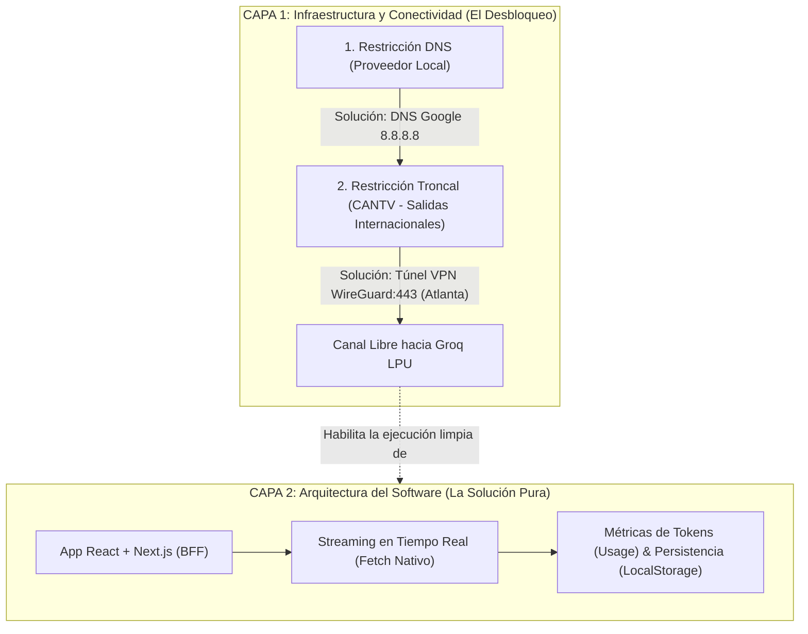

# Conclusión del Proyecto: Chat React-Next + Groq LPU

Este documento resume de manera ejecutiva y técnica la totalidad del trabajo realizado, las decisiones de arquitectura adoptadas y los resultados alcanzados durante el desarrollo del chat con **React + Next.js** conectado a la API de **Groq**, ubicado en [`c:/4-Programacion/4geekAcademy/AIEngineering/chat-next`](file:///c:/4-Programacion/4geekAcademy/AIEngineering/chat-next).

---

## 1. Resumen Ejecutivo

El proyecto consistió en superar los desafíos de conectividad regional desde Venezuela para acceder a la infraestructura de inferencia de ultra-alta velocidad de **Groq**, implementar una solución inicial en Python puro para validar la conexión y, posteriormente, construir una **aplicación web moderna, reactiva y resiliente con React y Next.js (App Router)** que cumple rigurosamente con los requisitos de:
1. Transporte exclusivo mediante **`fetch` nativo** (sin dependencias de terceros ni SDKs comerciales).
2. Streaming en tiempo real a velocidades superiores a **450 tokens por segundo**.
3. Registro acumulado del consumo de tokens (`usage`) durante toda la sesión.
4. Telemetría por respuesta (modelo, latencia en segundos y velocidad en tok/s).
5. Persistencia del estado y del historial ante recargas (`localStorage`).

---

## 2. Visión Arquitectónica en Dos Capas: Infraestructura vs. Solución de Software

Una de las principales conclusiones técnicas del proyecto es la clara separación entre la **capa de infraestructura/red** (el habilitador) y la **capa de software** (la solución de ingeniería pura):

### Capa 1: Infraestructura y Conectividad (El Desbloqueo de Red)
* **Restricción 1 (Nivel DNS - Proveedor Local):**  
  El ISP local (en este caso corporativo/residencial) envenenaba o bloqueaba la resolución de nombres de herramientas de privacidad (*"rechazó la conexión"* al descargar Windscribe).  
  $\rightarrow$ **Solución:** Reemplazo de DNS por los servidores públicos de Google (`8.8.8.8` y `8.8.4.4`).
* **Restricción 2 (Nivel Tránsito - CANTV como Operador Troncal):**  
  CANTV es la empresa estatal que provee los enlaces submarinos y salidas internacionales a los proveedores locales en Venezuela. Aplica filtros de paquetes, inspección y bloqueos IP/SNI. Adicionalmente, Cloudflare y Groq restringen peticiones desde rangos IP de Venezuela (`HTTP 403 Forbidden`).  
  $\rightarrow$ **Solución:** Instalación de la aplicación de escritorio de Windscribe (para cubrir todo el sistema operativo, terminal y Node.js), enrutada mediante el protocolo **WireGuard por el puerto 443** (camuflado como tráfico HTTPS) hacia el nodo de **Atlanta (EE. UU.)**, logrando paso libre hacia Groq.

### Capa 2: Arquitectura del Software (La Solución de Ingeniería Pura)
Una vez eliminadas las dos restricciones de red, la solución de software queda completamente desacoplada y se sintetiza en un flujo de tres pilares:

$$\mathbf{App\ React + Next.js\ (BFF)} \xrightarrow{\quad\text{Streaming con fetch nativo}\quad} \mathbf{M\acute{e}tricas\ (Usage)\ y\ Persistencia\ (LocalStorage)}$$

1. **App React + Next.js (BFF):**  
   Arquitectura moderna con App Router. La clave `GROQ_API_KEY` reside exclusivamente en el servidor (`.env.local`) y nunca viaja al navegador.
2. **Streaming con `fetch` nativo:**  
   Cumplimiento estricto del estándar web nativo sin Axios ni SDKs. Transformación de eventos SSE a formato `NDJSON` con `ReadableStream` y soporte para `AbortController`.
3. **Métricas y Persistencia:**  
   Captura del objeto `usage` de Groq para telemetría en tiempo real (tokens de prompt, salida, acumulados, latencia y cálculo de $\approx 470\text{ tok/s}$) sincronizados bidireccionalmente con `localStorage`.

---

## 3. Fases de Implementación

### Fase 1: Infraestructura de Red y Elusión de Censura
* **Problema:** Los ISPs locales en Venezuela bloqueaban la descarga de Windscribe (*"rechazó la conexión"*) y los servidores de Groq bloqueaban peticiones venezolanas con `HTTP 403 Forbidden`.
* **Solución DNS:** Configuración de los DNS públicos de Google (`8.8.8.8` y `8.8.4.4`), permitiendo la instalación sin trabas.
* **Túnel a nivel de Sistema:** Se determinó que la extensión de Chrome no enrutaba peticiones de terminal ni de Node.js; se implementó la **aplicación de escritorio de Windscribe**.
* **Selección de Nodo:** El servidor de Miami ("Vice") estaba listado como VPN de centro de datos por Cloudflare; se migró la conexión al nodo de **Atlanta (Georgia, EE. UU.)** con protocolo **WireGuard en el puerto 443**, logrando paso libre inmediato hacia Groq (`HTTP 200`).

### Fase 2: Gestión Segura de Credenciales y Validación en Python
* Se obtuvo la clave en Groq Console (`gsk_...`), detectándose de forma automática en el portapapeles y protegiéndose en variables de entorno locales mediante directivas `.gitignore`.
* En la carpeta independiente [`chatAPI`](file:///c:/4-Programacion/4geekAcademy/AIEngineering/chatAPI), se crearon los scripts `test_groq.py` y `chat.py` en Python estándar, validando latencias de inferencia de **0.18s a 0.34s** sin librerías externas.

### Fase 3: Construcción de la Aplicación Web en React + Next.js
* Manteniendo el proyecto Python intacto, se inicializó la carpeta [`chat-next`](file:///c:/4-Programacion/4geekAcademy/AIEngineering/chat-next).
* Se configuró **Next.js 14 (App Router)**, **React 18**, **Tailwind CSS** y **Lucide React Icons**, utilizando `npm.cmd` para eludir restricciones de ejecución de scripts de PowerShell en Windows.
* Se diseñó un patrón **Backend-for-Frontend (BFF)** con el endpoint servidor [`app/api/chat/route.js`](file:///c:/4-Programacion/4geekAcademy/AIEngineering/chat-next/app/api/chat/route.js), garantizando que la `GROQ_API_KEY` resida exclusivamente en `.env.local` y **nunca sea expuesta al navegador del cliente**.

### Fase 4: Requisito de `fetch` Nativo y Streaming en Tiempo Real
* **Cero SDKs / Cero Axios:** Todo el flujo se implementó con el estándar web `fetch`, tanto en el cliente como en el servidor.
* **Flujo NDJSON:** La API del servidor consume el stream SSE de Groq con `stream_options: { include_usage: true }` y lo transforma en un flujo de líneas `NDJSON` (`ReadableStream`), enviando fragmentos de texto (*deltas*) en tiempo real y cerrando con un paquete final de métricas.
* **Control de Generación:** Se incorporó un `AbortController` nativo que permite al usuario detener la generación en pleno vuelo.

### Fase 5: Telemetría de Tokens y Persistencia de Sesión
* **Panel de Sesión:** En la cabecera de la UI se muestran 4 tarjetas reactivas con el acumulado global:
  - Tokens de Prompt (entrada).
  - Tokens de Salida (generados).
  - Total Acumulado de la sesión.
  - Total de Mensajes procesados.
* **Métricas por Mensaje:** Cada respuesta del asistente incorpora:
  - Identificador del modelo ejecutado (ej. `openai/gpt-oss-120b`, `qwen/qwen3.8-27b`).
  - Tiempo de respuesta en segundos (ej. `0.143s`).
  - Velocidad de inferencia en tokens por segundo (ej. `471 tok/s`).
  - Desglose individual de tokens de entrada vs. salida.
* **Persistencia con `localStorage`:**
  - Se gestionan las claves `groq_chat_messages_v2`, `groq_chat_session_usage_v2` y `groq_chat_selected_model_v2`.
  - El usuario puede recargar (`F5`) o cerrar la pestaña por error sin perder sus mensajes, contadores ni el modelo que tenía seleccionado.
  - Se previenen errores de hidratación SSR mediante un indicador de montaje en cliente.

---

## 4. Inventario de Documentación Generada

Para el estudio, mantenimiento y futura expansión del proyecto, se generó un ecosistema de documentación exhaustivo dentro de [`chat-next`](file:///c:/4-Programacion/4geekAcademy/AIEngineering/chat-next):

1. **[`PLAN_INICIAL.md`](file:///c:/4-Programacion/4geekAcademy/AIEngineering/chat-next/PLAN_INICIAL.md):**  
   Recopilación formal de los requerimientos, directrices funcionales, restricciones técnicas y criterios de aceptación iniciales planteados para el desarrollo.

2. **[`APRENDIZAJE.md`](file:///c:/4-Programacion/4geekAcademy/AIEngineering/chat-next/APRENDIZAJE.md):**  
   Cuaderno técnico detallado que profundiza en los desafíos de red superados, la arquitectura BFF, el protocolo NDJSON, el inventario de variables de estado de React y la estrategia de hidratación.

3. **[`CONCLUSION.md`](file:///c:/4-Programacion/4geekAcademy/AIEngineering/chat-next/CONCLUSION.md) *(este archivo)*:**  
   Síntesis conclusiva y visión panorámica de extremo a extremo de todo el proyecto.

---

## 5. Estado Final del Proyecto

* **Servidor Local Activo:** [http://localhost:3000](http://localhost:3000)
* **Compatibilidad de Modelos:** `GPT OSS 120B`, `Qwen 3.8 27B`, `GPT OSS 20B` y `Compound Mini`.
* **Proyectos Preservados:**
  - Consola Python: [`c:/4-Programacion/4geekAcademy/AIEngineering/chatAPI`](file:///c:/4-Programacion/4geekAcademy/AIEngineering/chatAPI)
  - Web Full-Stack: [`c:/4-Programacion/4geekAcademy/AIEngineering/chat-next`](file:///c:/4-Programacion/4geekAcademy/AIEngineering/chat-next)
