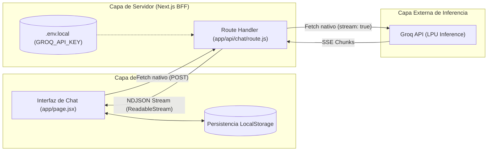

# Plan de Arquitectura de Software Puro (GitHub Edition)

Este documento define de forma estricta y exclusiva las especificaciones, requerimientos funcionales y la arquitectura de **software puro** para el desarrollo de la aplicación web de chat interactivo con **React + Next.js (App Router)** conectada a la API de **Groq**.

---

## 1. Requerimientos Funcionales y Restricciones de Software

### Requisito 1: Desacoplamiento y Entorno Independiente
* Construcción de una aplicación web completa y moderna en el directorio independiente `chat-next`, manteniendo la separación total con el prototipo de consola en Python.

### Requisito 2: Uso Indispensable y Exclusivo de `fetch` Nativo
* **Restricción estricta:** Todas las llamadas HTTP hacia el backend y hacia la API de inferencia deben implementarse **únicamente con la Fetch API estándar de JavaScript**.
* Queda terminantemente prohibido el uso de librerías externas de transporte (como Axios o Superagent) o SDKs de terceros (como `groq-sdk` o `openai`).

### Requisito 3: Captura y Telemetría de Tokens (`usage`)
* Capturar el objeto oficial `usage` emitido por Groq en cada respuesta para calcular, registrar y mostrar:
  1. **Tokens de Prompt (Entrada):** Consumo del contexto enviado.
  2. **Tokens de Completado (Salida):** Tokens generados por el modelo.
  3. **Consumo Acumulado de la Sesión:** Registro global persistente de toda la sesión activa.

### Requisito 4: Métricas de Rendimiento por Respuesta
* Presentar en la interfaz métricas visuales inmediatas asociadas a cada respuesta del asistente:
  - Nombre del modelo de IA ejecutado (ej. `openai/gpt-oss-120b`, `qwen/qwen3.8-27b`).
  - Tiempo de respuesta / latencia total en segundos.
  - Tasa de generación calculada en **tokens por segundo (tok/s)**.

### Requisito 5: Resiliencia y Persistencia de Sesión (`localStorage`)
* El historial de conversación, las métricas acumuladas y el modelo seleccionado deben persistir en el navegador mediante `localStorage`.
* El usuario no debe perder su trabajo ante recargas involuntarias (`F5`), cambios de pestaña o cierres accidentales del navegador.

### Requisito 6: Gestión Integral del Estado de la Interfaz (UI State)
* Control reactivo de estados:
  - Indicador de generación activa con bloqueo preventivo de envíos dobles.
  - Capacidad de cancelar la solicitud en curso mediante `AbortController`.
  - Selector dinámico de modelos de inferencia.
  - Copiado rápido de respuestas con confirmación visual.
  - Rutina de vaciado y reinicio limpio de la conversación y métricas.

---

## 2. Arquitectura de Software Puro (Next.js App Router)

$$\mathbf{App\ React + Next.js\ (BFF)} \xrightarrow{\quad\text{Streaming con fetch nativo}\quad} \mathbf{M\acute{e}tricas\ (Usage)\ y\ Persistencia\ (LocalStorage)}$$

### A. Capa de Servidor: Backend-for-Frontend (BFF)
* **Archivo:** `app/api/chat/route.js` (`POST`)
* **Aislamiento de Seguridad:** La credencial `GROQ_API_KEY` reside exclusivamente en variables de entorno del servidor (`.env.local`) y nunca se expone al cliente. Se provee un archivo `.env.example` como plantilla.
* **Transformación de Streaming:**
  - Envía la solicitud con `stream: true` y `stream_options: { include_usage: true }`.
  - Recibe el flujo Server-Sent Events (SSE) de Groq y lo retransmite al cliente en formato **NDJSON** (*Newline Delimited JSON*) mediante `ReadableStream`.
  - Emite eventos delta de texto progresivo y finaliza con el payload estructurado de telemetría y `usage`.

### B. Capa de Cliente: React SPA Reactiva
* **Archivo:** `app/page.jsx`
* **Tecnologías:** Next.js 14, React 18, Tailwind CSS, Lucide React Icons.
* **Estructura de Componentes:**
  1. **Header & Dashboard:** Panel de 4 tarjetas para visualizar en tiempo real los tokens acumulados (Total, Prompt, Salida, Mensajes) y selector de modelo.
  2. **Historial de Conversación:** Renderizado de burbujas con diseño oscuro, soporte multilínea y barra de métricas dedicada bajo cada respuesta del asistente.
  3. **Persistencia Sincronizada:** Lectura en el montaje (`useEffect`) y sincronización automática ante cambios, blindada contra discrepancias de hidratación SSR mediante la bandera `isLoadedFromStorage`.
  4. **Caja de Entrada:** Textarea autoajustable con atajos (`Enter` para enviar, `Shift + Enter` para multilínea) y botón de cancelación con `AbortController`.

---

## 3. Criterios de Aceptación de Software

| Criterio Técnico | Verificación | Estado |
| :--- | :--- | :---: |
| **Arquitectura Desacoplada** | Proyecto aislado en `chat-next` con su propio `package.json`. | ✅ Cumplido |
| **Transporte Estrictamente Nativo** | Uso de `fetch` estándar en cliente y servidor; cero Axios/SDKs. | ✅ Cumplido |
| **Streaming en Tiempo Real** | Emisión progresiva de tokens vía NDJSON a más de 450 tok/s. | ✅ Cumplido |
| **Telemetría Completa** | Visualización de prompt tokens, completion tokens y acumulado global. | ✅ Cumplido |
| **Métricas por Respuesta** | Medición de modelo, tiempo en segundos y tokens/segundo. | ✅ Cumplido |
| **Persistencia en Cliente** | Restauración automática de mensajes, contadores y modelo tras `F5`. | ✅ Cumplido |
| **Seguridad de Credenciales** | Clave resguardada en servidor; `.gitignore` y `.env.example` aplicados. | ✅ Cumplido |
