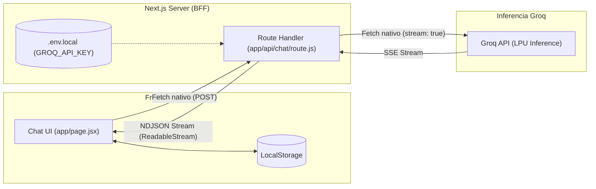

# Groq AI Chat (React + Next.js App Router)

Aplicación web full-stack de chat interactivo conectada a la infraestructura de inferencia ultrarrápida de **Groq LPUs**, desarrollada con **Next.js 14**, **React 18** y **Tailwind CSS**.

---

## 🏛️ Arquitectura de la Solución

$$\mathbf{App\ React + Next.js\ (BFF)} \xrightarrow{\quad\text{Streaming con fetch nativo}\quad} \mathbf{M\acute{e}tricas\ (Usage)\ y\ Persistencia\ (LocalStorage)}$$



---

## ✨ Características Principales

1. **Transporte Estrictamente Nativo:**
   - Implementado al 100% con **`fetch` estándar** tanto en el cliente como en el servidor.
   - Sin librerías HTTP pesadas (sin Axios, sin Superagent) ni SDKs comerciales de terceros.

2. **Inferencia en Tiempo Real (Streaming NDJSON):**
   - Transmisión por líneas en tiempo real mediante `ReadableStream` con velocidades superiores a **450 tokens/segundo**.
   - Soporte para cancelación de respuestas en pleno vuelo mediante `AbortController`.

3. **Telemetría y Métricas Oficiales de Groq (`usage`):**
   - **Métricas por respuesta:** Identificador del modelo, tiempo exacto en segundos (`total_time`), tasa de generación en `tokens/segundo` y desglose de tokens de entrada vs. salida.
   - **Panel de sesión acumulado:** Contador persistente de tokens totales, prompt tokens, completion tokens y mensajes procesados.

4. **Persistencia de la Sesión (`localStorage`):**
   - El historial de mensajes, las métricas y el modelo seleccionado sobreviven a recargas accidentales (`F5`) o cierres de pestaña.
   - Protección contra discrepancias de hidratación en SSR.

5. **Catálogo de Modelos Soportados:**
   - `openai/gpt-oss-120b` (Razonamiento profundo y generación de código).
   - `qwen/qwen3.8-27b` (Ultra rápido, multimodal y multilingüe).
   - `openai/gpt-oss-20b` (Ligero y ágil).
   - `groq/compound-mini` (Balanceado).

---

## 📁 Estructura del Proyecto

```text
chat-next/
├── app/
│   ├── api/
│   │   └── chat/
│   │       └── route.js       # Route Handler con streaming NDJSON y captura de usage
│   ├── globals.css            # Estilos globales y personalización de scrollbar
│   ├── layout.jsx             # Shell HTML con tema oscuro
│   └── page.jsx               # Interfaz de usuario interactiva y persistencia
├── .env.example               # Plantilla de variables de entorno
├── .gitignore                 # Reglas de exclusión para Git (ignora .env*)
├── package.json               # Dependencias del proyecto
├── tailwind.config.js         # Configuración de estilos Tailwind
├── postcss.config.mjs
├── next.config.mjs
├── PLAN_INICIAL.md            # Requisitos y criterios de aceptación originales
├── APRENDIZAJE.md             # Cuaderno de bitácora técnica exhaustiva
└── CONCLUSION.md              # Resumen ejecutivo y arquitectura en dos capas
```

---

## 🚀 Puesta en Marcha

### 1. Clonar el repositorio e instalar dependencias:
```bash
git clone <URL_DEL_REPOSITORIO>
cd chat-next
npm install
```

### 2. Configurar la clave de API:
Copia el archivo de ejemplo y coloca tu clave de Groq:
```bash
cp .env.example .env.local
```
Edita `.env.local` con tu clave obtenida en [console.groq.com/keys](https://console.groq.com/keys):
```env
GROQ_API_KEY=gsk_tu_clave_aqui
```

### 3. Iniciar el servidor de desarrollo:
```bash
npm run dev
```
Abre en tu navegador: **[http://localhost:3000](http://localhost:3000)**

---

## 📚 Documentación Técnica Detallada

* **[PLAN_INICIAL.md](./PLAN_INICIAL.md):** Requerimientos iniciales y criterios de aceptación.
* **[APRENDIZAJE.md](./APRENDIZAJE.md):** Bitácora técnica, retos de red superados y gestión del estado en React.
* **[CONCLUSION.md](./CONCLUSION.md):** Síntesis de extremo a extremo y separación de capas de infraestructura vs. software.
